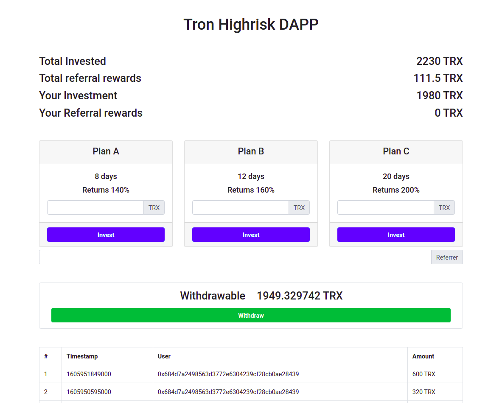

# Tron high risk DAPP
An open-source Highrisk DAPP (Decentralized application) on Tron blockchain


## Smart contract Compile and Deployment
Compile and deployment can be achieved via [Tronscan](https://tronscan.org/#/contracts/contract-compiler).

CONTRACT_ADDRESS in app.js should get replaced with your contract address.

## Prerequisites
```
npm install
```


## Start DAPP
```
npm run dev
```

## Demo
[url to demo page](https://vahidfzm.github.io/tron-high-risk-dapp/index.html)



PS: The demo-contract is published on Shasta network (a test network in tron blockchain) and to use it, you need to switch to shasta-node in Tronlink wallet. 
